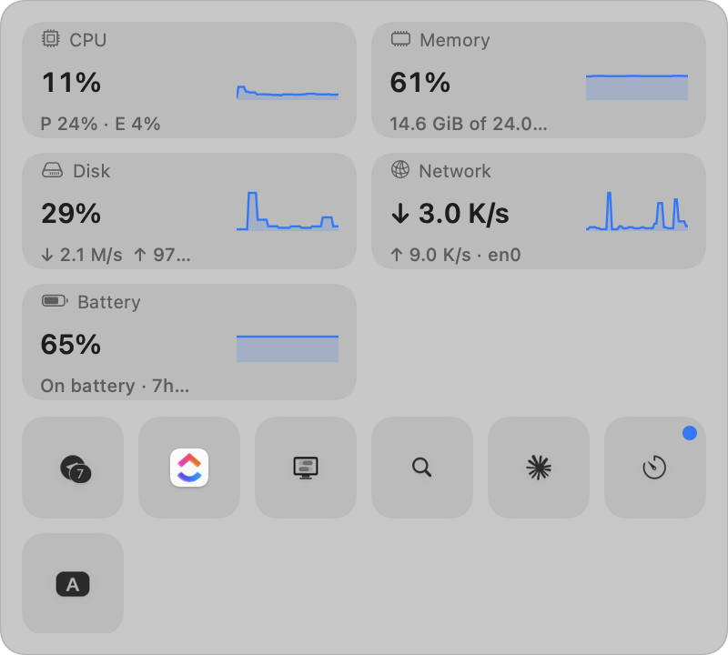
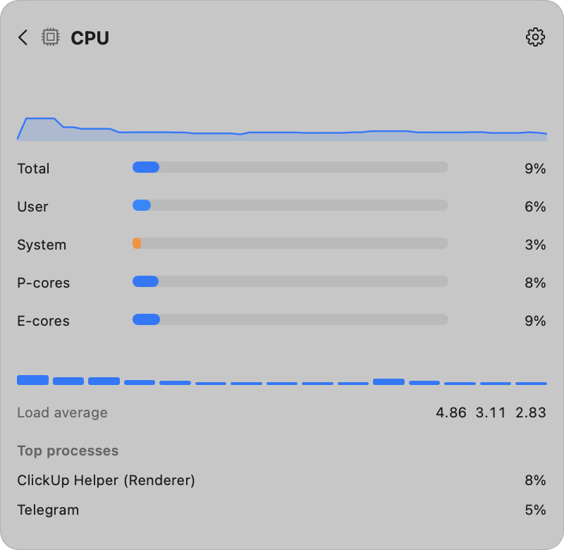
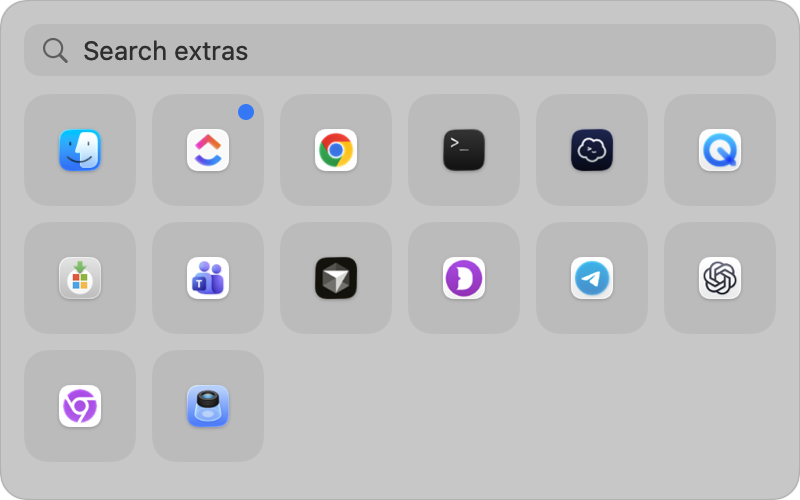
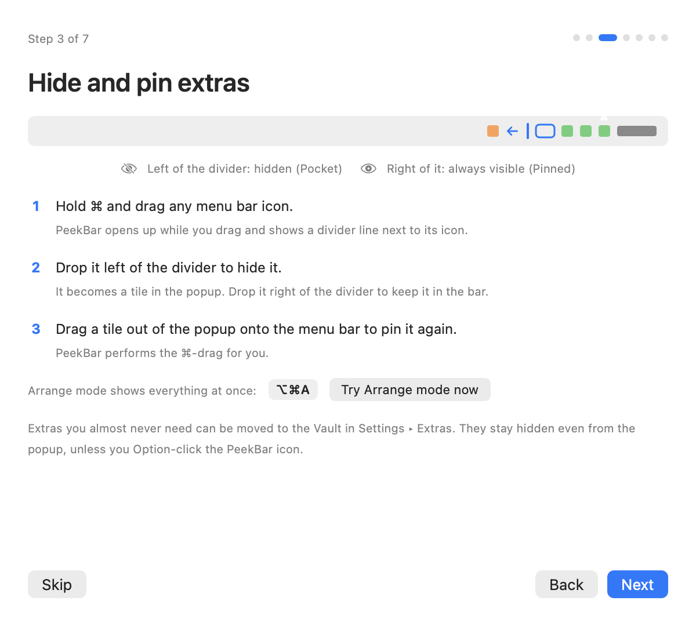

# PeekBar

**A notch-safe macOS menu bar manager with a Control Center–style popup, plus the full system-monitoring feature set of Stats.**

PeekBar keeps your menu bar short. Extras you don't need all the time are hidden and revealed in a popup under the bar, so nothing ever ends up unclickable under the camera housing. The same popup can show live CPU, memory, disk, network, battery, GPU, sensor, Bluetooth and clock readings, any of which can also be pinned to the bar as a compact widget, with threshold notifications.

Built from `PeekBar_SRS_v0.1.pdf` (SRS + product brief). Open questions in SRS §16 were resolved with the SRS's own suggested defaults; later additions (monitoring, widgets, alerts, reveal modes, walkthrough) came from product feedback.

| | |
|---|---|
|  |  |
|  |  |

---

## Contents

1. [Requirements](#requirements)
2. [Install](#install)
3. [First run](#first-run)
4. [Using PeekBar](#using-peekbar)
5. [System monitoring](#system-monitoring)
6. [Settings reference](#settings-reference)
7. [Keyboard shortcuts](#keyboard-shortcuts)
8. [Privacy and permissions](#privacy-and-permissions)
9. [Architecture](#architecture)
10. [Build, sign, package](#build-sign-package)
11. [Testing](#testing)
12. [Troubleshooting](#troubleshooting)
13. [Known limitations](#known-limitations)
14. [SRS traceability](#srs-traceability)
15. [Project layout](#project-layout)

---

## Requirements

- macOS 12 Monterey or later. Developed and tested on macOS 26.5 (Xcode 26.6) and verified by the author on an M1 Pro running macOS 15.
- Apple Silicon or Intel (universal binary).
- Quit other menu-bar hiding tools first (Hidden Bar, MenubarHide, Ice, Bartender). Two hiding separators in one bar fight each other.

Platform notes:

| macOS | Difference |
|---|---|
| 12 | Tile icons use the legacy window-capture API; launch at login must be added manually under Users & Groups ▸ Login Items. |
| 13 | Launch at login via `SMAppService` works; capture still legacy. |
| 14+ | ScreenCaptureKit per-window screenshots. |
| 26 | Every status-item window is owned by Control Center, so PeekBar identifies extras through the Accessibility API instead of window ownership. |

## Install

1. Open `PeekBar-0.1.0.dmg` (built by `Scripts/make_dmg.sh`, see [Build](#build-sign-package)) and drag **PeekBar** into **Applications**.
2. The app is signed with a local certificate, not an Apple Developer ID. On any Mac other than the build machine, Gatekeeper will refuse the first launch. Either right-click **PeekBar.app ▸ Open ▸ Open**, or run:

   ```bash
   xattr -dr com.apple.quarantine /Applications/PeekBar.app
   ```

3. Launch PeekBar. It has no Dock icon; look for the chevron at the left end of your status icons.

## First run

A seven-step walkthrough opens on first launch (and any time from the PeekBar menu ▸ **Walkthrough…** or Settings ▸ About):

1. **Welcome** – the three zones on a notched bar.
2. **Two permissions** – Screen Recording (draws the real icons on tiles) and Accessibility (clicks them for you, identifies owners). Live status, Allow buttons, "Check again".
3. **Hide and pin extras** – ⌘-drag past the divider; "Try Arrange mode now".
4. **The popup** – click, right-click, search, keys; "Open the popup now".
5. **Dashboard and widgets** – ⌥⌘S, modules, menu bar widgets; opens Monitoring settings.
6. **Alerts** – threshold notifications; opens Alerts settings.
7. **You're set** – shortcut cheat sheet and "Start in Arrange mode now".

If a permission was granted but macOS keeps asking, quit and reopen PeekBar once. Without permissions PeekBar still hides extras; the popup shows a reminder instead of icons.

## Using PeekBar

### Zones

| Zone | Where | How it gets there |
|---|---|---|
| **Pinned** | Always in the menu bar, right of the PeekBar icon. | ⌘-drag an icon right of the divider, or drag a popup tile onto the bar. |
| **Pocket** | Hidden from the bar; shown in the popup. | ⌘-drag an icon left of the divider. New extras land here automatically and carry a "New" badge. |
| **Vault** | Hidden from the bar and from the default popup. | Settings ▸ Extras ▸ Move to Vault. Shown when you Option-click the icon or choose "Show Popup with Vault". |

Zones are physical: everything left of the PeekBar icon (its spacer item) is pushed off-screen by the collapse; Vault is a flag on hidden extras.

### Hiding and pinning

- **Hide**: hold ⌘ and start dragging any status icon. PeekBar expands automatically, a divider line appears next to its icon, and dropping the icon left of the line hides it. PeekBar collapses again when you let go.
- **Pin**: drag a tile out of the popup and drop it on the menu bar. PeekBar expands, performs the ⌘-drag for you, verifies the result and collapses.
- **Arrange mode** (⌥⌘A, or the menu): shows everything at once with a HUD explaining the divider. On an overflowing notched bar it warns which extras cannot be dragged.
- **Settings ▸ Extras**: per-extra "Move to Pinned / Pocket / Vault" (moves across the divider synthetically), New badges, Known incompatible list, Reset, Export/Import layout as JSON.

An extra that macOS refuses to draw even with the bar fully expanded (bar wider than the space beside the notch) cannot be ⌘-dragged by anyone. PeekBar reports "Not enough room" for those; hide something else first.

### Reveal modes (Settings ▸ General ▸ Reveal hidden extras)

| Mode | Icon | Click does |
|---|---|---|
| **Vault — open below in a popup** (default) | chevron down (up while open) | Opens the popup under the bar. The bar never moves. |
| **Pocket — open to the left in the menu bar** | chevron left (right while expanded) | Slides the hidden icons back into the bar, Hidden Bar style; click again to hide. The popup auto-close delay doubles as the auto-hide delay. Option-click or ⌥⌘S still opens the popup. |

### The popup

- Opens 8 pt under the menu bar band, right-aligned to the PeekBar icon (or under the widget you clicked), on the display under the pointer, clamped on-screen, never inside the camera housing.
- Tiles show the captured icon (template icons are tinted for the current appearance), a "New" dot, hover highlight, focus ring.
- **Click** a tile: the extra's real menu opens (Accessibility press; falls back to a click delivered to the owning process, then to a real click). PeekBar keeps the bar revealed until the menu or popover closes, then collapses.
- **Right-click** a tile: forwarded as a right-click.
- **Search** appears above 12 extras or as soon as you type.
- **Keys**: arrows / Tab move, Return activates, Esc closes (or returns from a detail page).
- Dismisses on click outside, Esc, second click on the icon, Space change, or the auto-close timer (restarts while the pointer is inside).

## System monitoring

Nine modules, Stats parity minus fan control:

| Module | Card shows | Detail page | Data source |
|---|---|---|---|
| CPU | total %, P/E-core split, sparkline | user/system, P/E bars, per-core bars, load average, temperature, top 5 processes | `host_processor_info`, `sysctl hw.perflevel*`, `getloadavg`, `proc_pidinfo` |
| Memory | used %, used of total | app/wired/compressed/cached bars, pressure, swap, top apps | `host_statistics64`, `hw.memsize`, `vm.swapusage`, `kern.memorystatus_level`, `proc_pid_rusage` |
| Disk | used % of the boot volume, read/write rates | per-volume bars, read/write charts | `FileManager.mountedVolumeURLs`, IOKit `IOBlockStorageDriver` statistics |
| Network | download rate, upload rate, interface | up/down charts, interface/type, local IPv4/IPv6, optional public IP, session totals | `getifaddrs`, `NWPathMonitor` |
| Battery | charge %, state, time left | charge, state, time, health, cycles, temperature, wattage, adapter | `IOPowerSources`, `AppleSmartBattery` registry |
| GPU | utilization %, name | utilization/renderer/tiler bars, memory in use | `IOAccelerator` `PerformanceStatistics`, Metal for the name |
| Sensors | hottest CPU temp, fan/GPU/power | grouped list: CPU, GPU, system, memory, storage, battery, ambient, fans, power (voltage/current in advanced mode) | AppleSMC user client (read-only) + Apple Silicon HID temperature services |
| Bluetooth | connected count, first battery | paired devices with connection state and battery (left/right/case for earbuds) | IORegistry `BatteryPercent*` + `IOBluetoothDevice.pairedDevices()` |
| Clock | first clock | all clocks with date and offset ("+9h, tomorrow") | Foundation |

- **Dashboard**: cards above the extras grid (or below, or on their own page). ⌥⌘S opens it; click a card for details; Esc goes back.
- **Menu bar widgets**: tick "Menu bar" on a module. Styles: mini, line chart (32/44/60 pt), bar chart (per core), ring, tachometer, label, speed (↓/↑), battery, memory bar, state dot; optional 3-letter label; colour by load. Right-click a widget for style/colour/label/remove/details; ⌘-drag to reorder. Widgets always sit right of the PeekBar icon; if you drag one left of the divider it stays hidden until "Move back" in Settings. If a widget lands where macOS won't draw it (beside the notch) it falls back to the mini style, then warns in Settings.
- **Alerts** (Settings ▸ Alerts): rule = metric, above/below, threshold, sustained duration. Fires after the breach lasts the chosen time, clears with hysteresis (5 % for percentages, 3 °C for temperatures, 10 % for rates), repeats at most every 5 minutes. Delivered as macOS notifications; clicking one opens the module's page.
- **Sampling is demand-driven**: a module is read only while a card, widget or alert needs it (alert-only modules at ≥ 5 s). With the popup closed and no widgets, nothing samples at all. Measured here: ~1 % CPU and ~20–40 MB with four widgets live.
- **Units**: Celsius/Fahrenheit, binary (GiB) or decimal (GB). Sampling interval 1/2/5 s (slower modules keep their own floor). Network interface can be pinned. Public IP lookup (api.ipify.org, every 10 min) is off by default and is PeekBar's only network request.

## Settings reference

| Tab | Contents |
|---|---|
| **General** | Launch at login; Show in Dock; collapse delay after launch (1.5–3 s recommended so late-launching extras are zoned); popup shortcut + Arrange shortcut recorders with conflict warnings; reveal mode (Vault/Pocket); show names under tiles; close behaviour after activation (Smart / Always / Keep open); auto-close delay; live icon refresh rate; open popup on hover; refresh icons by brief reveal. |
| **Extras** | Pinned / Pocket / Vault lists with icons, owners, New badges, per-extra move menu; Arrange in Menu Bar; Refresh; Clear New badges; Export/Import layout; Reset; Known incompatible extras with reasons. |
| **Monitoring** | Dashboard placement; dashboard shortcut; module enable + "Menu bar" widget toggle + style, label, colour, chart width, Move back; sampling interval; temperature/size units; clocks editor (up to 8 time zones); network interface; public IP opt-in. |
| **Alerts** | Notification permission status/Allow/System Settings/Send test; rules list with add/remove, metric, comparator, threshold in display units, sustained time, enabled, "Active" badge. |
| **Permissions** | Screen Recording and Accessibility status with Allow and System Settings deep links; login item status; what works without permissions. |
| **About** | Version, privacy statement, Show walkthrough again, Show debug tools (collapse length, last capture error, catalog dump, force rescan, flash refresh). |

## Keyboard shortcuts

| Default | Action | Change in |
|---|---|---|
| ⌥⌘B | Show/hide the popup (or expand/collapse the bar in Pocket mode) | General |
| ⌥⌘A | Arrange mode on/off | General |
| ⌥⌘S | Open the dashboard | Monitoring |
| ⌥ click on the icon | Popup including Vault extras | – |
| Esc | Close popup / back from a detail page | – |
| ⌘-drag any icon | Auto-expand and hide/pin | – |

Every shortcut is checked against the system's own shortcut table and against each other.

## Privacy and permissions

- **Screen Recording** is used only to screenshot status-item windows (one window at a time, never the desktop). Frames live in memory and are never written to disk.
- **Accessibility** is used only to press status items and to read the "extras menu bar" of each app for identification. No other windows or documents are read.
- **Notifications** are requested when you add the first alert rule or press "Send test".
- No telemetry, no account, no update checks. The only network request is the opt-in public-IP lookup.
- Hardware access is read-only: the SMC client has no write path, fan control is deliberately excluded.
- Info.plist declares `NSBluetoothAlwaysUsageDescription` defensively; Bluetooth data comes from the I/O Registry, so no prompt appears.

## Architecture

SwiftPM package, two targets plus tests, no Xcode project (open `Package.swift` in Xcode if you prefer).

```
PeekBarCore  (Foundation-only library, everything unit-tested)
PeekBar      (AppKit + SwiftUI executable)
PeekBarCoreTests
```

### Core (`Sources/PeekBarCore`)

| File | Types |
|---|---|
| `Zone.swift` | `Zone`, `ExtraID` |
| `ExtraIdentity.swift` | stable ids from bundle id + title/window name, duplicate ordinals, display names |
| `ZoneResolver.swift` | hidden = left of the spacer; vault flag resolution |
| `LayoutStore.swift` | JSON persistence of zone intent, New flags, incompatible reasons; export/import |
| `CollapseMath.swift` | collapse length from the widest screen (cap 10,000 pt) |
| `Geometry.swift` | coordinate conversion, `ScreenGeometry` (notch/safe area), `PopupPositioner`, `VisibilityCheck`, `NotchFit`, `RevealMath` |
| `PopupLayout.swift` | grid/dashboard/detail sizing, keyboard navigation, search filter |
| `Policies.swift` | auto-close, close behaviour, live refresh, activation outcome, permissions, `DashboardPlacement`, `RevealMode` |
| `HotKey.swift` | `KeyCombo`, key names, system-shortcut conflict check |
| `DisplayDedupe.swift` | drops the per-display copies macOS draws of every status item |
| `Widgets.swift` | `WidgetStyle`, `WidgetConfig`, widths, positions, placement classification |
| `Metrics/ModuleID.swift`, `Readings.swift`, `MetricKey.swift` | module ids, reading structs, series keys |
| `Metrics/HistoryBuffer.swift` | ring buffer + `MetricHistory` |
| `Metrics/UnitFormatter.swift` | bytes, rates, percent, temperature, duration, power |
| `Metrics/CPUTickMath.swift`, `RateMath.swift`, `MemoryMath.swift` | deltas, wrap-safe rates, Activity Monitor memory breakdown |
| `Metrics/SensorCatalog.swift` | SMC key → label/group/unit, all SMC type decoders, per-group curation |
| `Metrics/ClockFormatter.swift` | world clocks with offsets |
| `Metrics/DemandSet.swift` | which modules must sample |
| `Metrics/AlertRule.swift` | rules + stateful `AlertEvaluator` (duration, hysteresis, cooldown) |

### App (`Sources/PeekBar`)

| File | Responsibility |
|---|---|
| `AppDelegate.swift` | Wires everything; popup/dashboard/arrange/sideways flows; settings sinks; context menu; ⌘-drag monitor; debug bridge command table |
| `StatusItemController.swift` | The two status items (glyph + collapsing spacer), collapse/expand/reveal, self-placement repair, glyphs per reveal mode |
| `ExtraCatalog.swift` | Enumerates status-item windows (`CGWindowList` layer 25), dedupes per-display copies, matches Accessibility elements, builds identities and zones |
| `AccessibilityBridge.swift` | AX extras menu bar enumeration, press/show-menu |
| `CaptureService.swift` | ScreenCaptureKit (14+) / legacy window capture, blank detection, in-memory cache |
| `ActivationService.swift` | Tile → real extra: reveal, AX press / pid click / HID click, menu-or-popover detection, synthetic ⌘-drag moves |
| `PopupPanel.swift`, `PopupView.swift`, `PopupModel.swift` | Non-activating panel, pages (home/dashboard/detail), grid, search, keyboard, drag-out |
| `DashboardViews.swift` | Cards, sparklines, detail pages per module |
| `WidgetView.swift`, `WidgetController.swift` | AppKit widget drawing (10 styles), widget status items with their own autosave generation, placement checks |
| `Metrics/MetricsEngine.swift`, `MetricsStore.swift` | Demand-driven actor sampler; main-actor store with history and alert evaluation |
| `Metrics/Modules/*.swift` | One module per file |
| `Metrics/Support/*.swift` | `IORegistry`, `ProcessList`, `SMCClient`, `HIDSensors` |
| `NotificationService.swift` | `UNUserNotificationCenter` delivery and click handling |
| `SettingsViews.swift`, `MonitoringSettingsView.swift`, `AlertsSettingsView.swift`, `SettingsWindow.swift` | Settings tabs |
| `OnboardingWindow.swift` | Walkthrough |
| `ArrangeMode.swift` | Arrange HUD |
| `HotKeyManager.swift`, `LoginItem.swift`, `Preferences.swift`, `AppState.swift`, `Support.swift`, `DebugBridge.swift` | Infrastructure |

### Key mechanics

- **Hiding** uses the separator-length technique: the spacer item grows to the widest screen's width, pushing everything left of it off-screen. Its length is refreshed on display changes and wake. The first collapse after launch waits (configurable) so late-launching extras are zoned.
- **Own items and AppKit quirks**: `removeStatusItem` deletes an item's saved position asynchronously, and a re-created item with the same autosave name ignores a new position within the same process. PeekBar therefore rebuilds its items under a new autosave-name *generation* (`peekbar_toggle_N`) whenever it needs macOS to honour a computed position. Widgets use an independent generation counter.
- **Self-placement**: on an overflowing bar a new status item lands under the notch where macOS never draws it. After launch PeekBar checks that its icon and every pinned extra are actually drawn, and if not moves itself to the left edge of the drawn cluster (up to three passes). Extras that were already lost under the notch become the first Pocket.
- **Identity on macOS 26**: all status windows are owned by Control Center, so ownership can't identify apps. Each running app's Accessibility "extras menu bar" is matched to windows by centre containment (Control Center reports frames inset by 8 pt). Window titles (need Screen Recording) are preferred for the identity key; live-state descriptions ("Wi‑Fi, connected, 3 bars") are trimmed to their first segment.
- **Multi-display**: every status item exists once per display sharing the primary's menu bar band; secondary copies are removed by on-screen containment and by matching the display offset.
- **Capture**: off-screen windows capture blank, so icons are captured whenever the bar is expanded (before every collapse, during Arrange mode, during activations) and cached in memory. Missing icons trigger one brief reveal per 30 s when the popup opens.
- **Activation**: expand fully (a partial "targeted" reveal was tried and dropped because macOS re-sorts neighbours), press via Accessibility, else deliver the click to the owning process (no cursor movement), else a real click. Any new window above the normal layer counts as "something opened" (menus and Control Center popovers alike); the bar stays revealed until it closes.
- **Popup geometry**: `PopupPositioner` puts the panel 8 pt under the menu bar band (`safeAreaInsets.top` on notched displays), right-aligned, clamped to the display, height capped at 60 % with internal scrolling.
- **Geometry settle**: the window server takes ~150 ms to reflow after the spacer changes length; scans and popup opens are deferred until settled.

## Build, sign, package

```bash
swift test                  # unit tests (80)
Scripts/build_app.sh        # universal release build -> dist/PeekBar.app
Scripts/make_dmg.sh         # -> dist/PeekBar-0.1.0.dmg with Applications link and READ ME
Scripts/smoke_test.sh       # launches the app with --debug-bridge and exercises it
```

Signing order in `build_app.sh`:

1. `SIGN_IDENTITY="Developer ID Application: …"` → signed with timestamp; notarize the DMG with `notarytool` before shipping.
2. Otherwise the local self-signed identity **PeekBar Local Signing** in `Packaging/PeekBar-signing.keychain-db` (password `peekbar`, certificate in `docs/PeekBar-signing-cert.pem`). The keychain is git-ignored (it holds the private key). A stable identity keeps Screen Recording/Accessibility grants across rebuilds. On another build machine: recreate a self-signed code-signing certificate with that name, or import the keychain and run `security add-trusted-cert -r trustRoot -p codeSign` on the certificate once.
3. Otherwise ad hoc (permissions must be re-granted after every rebuild).

`Packaging/Info.plist` sets `LSUIElement`, `LSMinimumSystemVersion 12.0`, the bundle id `com.peekbar.app`, and usage strings. The app icon is drawn by `Packaging/make_icon.swift` at build time. ScreenCaptureKit is weak-linked so macOS 12.0–12.2 can launch.

## Testing

**Unit tests** (`swift test`, 80 cases): identity and duplicates, zoning, layout store persistence/export, collapse math, coordinate conversion, popup positioning against real 14-inch notch geometry, dashboard/detail sizing, grid navigation, search, policies, hotkeys and conflicts, reveal math, per-display dedupe, widget widths/positions/placement, history buffer, CPU tick math, 32-bit counter wrap, memory breakdown, unit formatting, demand sets, SMC decoders (`sp78`, `fpe2`, `flt`, …), sensor descriptions and curation, clock offsets, alert evaluator (spike vs sustained, hysteresis, cooldown).

**Debug bridge**: launch with `--debug-bridge` and drive the app with `dist/pbctl <cmd> [arg]` (built from `Scripts/pbctl.swift`). It uses distributed notifications, so the test runner needs no permissions.

| Command | Purpose |
|---|---|
| `ping`, `status`, `verifyReport`, `defaults` | health, geometry, repair state, saved positions |
| `dump <path>` | extra catalog as JSON |
| `collapse`, `expand`, `reveal <key>`, `revealBoundary`, `rebuild <pos>` | spacer control |
| `openPopup`, `openVault`, `closePopup`, `togglePopup`, `popupFrame`, `popupTiles`, `tileImages`, `snapshot <png>`, `previewTiles <n>`, `popupKey <keyCode>` | popup |
| `activate <key>`, `movePin <key>`, `moveHide <key>`, `axinfo <key>`, `axprobe <pid>`, `escape` | activation and moves (need Accessibility) |
| `arrange`, `arrangeDone`, `revealMode <popup|sideways>`, `primaryClick`, `toggleSnapshot <png>` | modes |
| `metrics <path>`, `sampleNow <module>`, `moduleOn/Off <module>`, `engineTasks`, `engineTasksAsync`, `smcKeys` | monitoring |
| `openDashboard`, `openDetail <module>`, `popupPage` | dashboard |
| `widgetOn <module>[:<style>]`, `widgetOff`, `widgetFrames`, `widgetSnapshot <module>:<png>`, `widgetVerify`, `widgetMoveBack` | widgets |
| `alertRule "<module.metric> <above|below> <threshold> <seconds>"`, `alertsClear`, `alertStatus`, `alertTest` | alerts |
| `settingsTab <name>`, `settingsSnapshot <png>`, `walkStep <0-6>`, `onboardingSnapshot <png>`, `closeWindows`, `skipOnboarding`, `requestAX`, `requestSR`, `quit` | windows |

`Scripts/smoke_test.sh` seeds status positions, launches the app, and checks collapse, hiding, popup placement, arrange mode, dashboard, detail/Esc, widgets and an alert rule end to end.

## Troubleshooting

| Symptom | Fix |
|---|---|
| "PeekBar is damaged" / can't be opened on another Mac | Gatekeeper and the local certificate: right-click ▸ Open, or `xattr -dr com.apple.quarantine /Applications/PeekBar.app`. |
| Popup keeps asking for Screen Recording after allowing | Quit and reopen PeekBar once. If it persists, remove PeekBar from the Screen Recording list and add it again. |
| Tiles show placeholders instead of icons | Screen Recording missing, or the extra never fits beside the notch so it can never be captured; tiles then show the app icon. |
| Clicking a tile shows an error | Accessibility missing (hand icon), or the extra cannot be revealed because the bar is too wide for the notch. The reason is listed under Settings ▸ Extras ▸ Known incompatible. |
| PeekBar's icon is not visible | The bar overflows; the self-placement repair runs for ~14 s after launch. Quit other hiding tools. |
| Icons duplicated in the popup | Fixed for displays sharing the primary's top edge; report the display arrangement if it recurs. |
| Widgets vanish or move | They were dragged left of the divider; Settings ▸ Monitoring ▸ Move back. |
| Fans read 0 rpm | Fans are idle; values come straight from the SMC. |

Debug tools (Settings ▸ About ▸ Show debug tools, or hold Option on the PeekBar menu) show the collapse length, last capture error and catalog/metrics dumps in `~/Library/Application Support/PeekBar/`.

## Known limitations

- Not notarized: first launch of a downloaded copy needs right-click ▸ Open.
- Menu bar auto-hide (SRS F-73) is not force-revealed when the popup opens.
- Reordering within a zone from the Settings list is not implemented (⌘-drag in the bar instead); moving across zones is.
- Extras that don't fit beside the notch even when fully expanded cannot be ⌘-dragged or captured; they remain reachable through the popup via Accessibility.
- SMC key naming was verified on M5 Pro and M1 Pro; other chips may need catalog additions (`SensorCatalog.swift`).
- Presentation profile (Q11), iCloud sync (F-65), desktop widgets and a remote dashboard are out of scope.

## SRS traceability

| SRS | Where |
|---|---|
| F-01…F-07 zoning | `ZoneResolver`, `LayoutStore`, Settings ▸ Extras, Option-click for Vault |
| F-10…F-19 popup | `PopupPanel`, `PopupView`, `PopupPositioner`, `PopupLayout` |
| F-30…F-33 activation | `ActivationService`, Known incompatible list |
| F-40…F-43 arrange | `ArrangeMode`, ⌥⌘A, synthetic ⌘-drag moves |
| F-50…F-53 shortcuts, hover, auto-close | `HotKeyManager`, `StatusItemController` hover, `PopupController` timers |
| F-60…F-64 settings/system | `LoginItem`, Settings tabs, deep links, JSON export/import |
| F-70…F-74 displays | `PopupPositioner.mirroredAnchorMaxX`, `DisplayDedupe`, `ScreenGeometry` from `NSScreen` safe areas |
| F-80…F-84 robustness | `CollapseMath`, `StatusItemController` (force visible, delayed collapse, generation repair) |
| §11 privacy | this README, Permissions tab, walkthrough step 2 |
| §13 non-functional | demand-driven sampling, ~1 % CPU, memory well under 80 MB |

## Project layout

```
Package.swift
Packaging/        Info.plist, make_icon.swift, signing keychain (ignored) and certificate
Scripts/          build_app.sh, make_dmg.sh, smoke_test.sh, pbctl.swift
Sources/PeekBarCore/   pure logic (+ Metrics/)
Sources/PeekBar/       app (+ Metrics/Modules, Metrics/Support)
Tests/PeekBarCoreTests/
docs/images/      screenshots used above
dist/             build output (ignored)
```

No license file has been added yet; add one before publishing.
